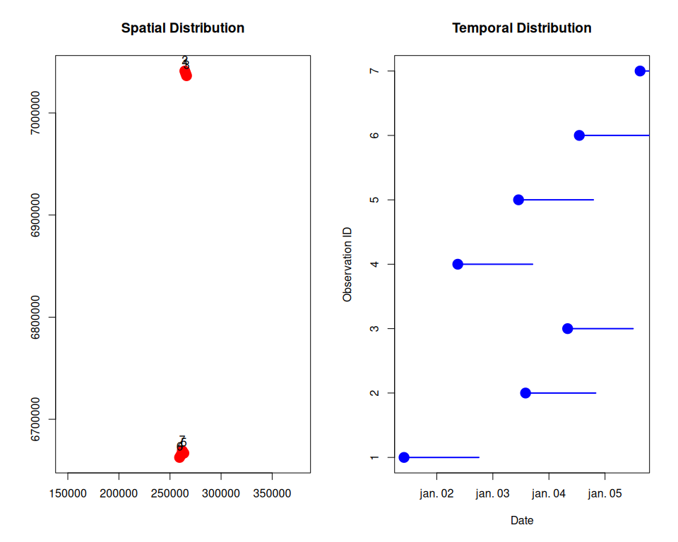

Lynx Family Groups Pipeline
================
Miljodirektoratet
2026-03-01

- [1. Setup and Load Libraries](#1-setup-and-load-libraries)
- [2. Load and Explore Data](#2-load-and-explore-data)
- [3. Group Observations (Automatic Configuration
  Selection)](#3-group-observations-automatic-configuration-selection)
- [4. Create Visualization Objects](#4-create-visualization-objects)
- [5. Interactive Map Visualization](#5-interactive-map-visualization)
- [6. Results Summary](#6-results-summary)
- [7. Export Results](#7-export-results)
- [8. Session Information](#8-session-information)

This notebook walks through the spatial analysis and grouping of lynx
family observations. The main steps include:

1.  Loading and exploring test data stored in the `gaupefam` package
2.  Comparing grouping methods (sensitivity analysis)
3.  Grouping observations with optimal configuration
4.  Creating visualization objects
5.  Interactive mapping
6.  Optional: Exporting results

## 1. Setup and Load Libraries

``` r
# Detect base path using here package
if (!requireNamespace("here", quietly = TRUE)) install.packages("here")
library(here)
base_path <- here::here()

# Install and load gaupefam from GitHub
if (!requireNamespace("gaupefam", quietly = TRUE)) {
  remotes::install_github("miljodirektoratet/dp-gaupe-familiegrupper")
}
library(gaupefam)

# Load other required packages
library(sf) # Spatial data handling
library(dplyr) # Data manipulation
library(leaflet) # Interactive maps
library(htmlwidgets) # Save interactive maps
library(viridis) # Color palettes

# Enable s2 for spherical geometry
sf::sf_use_s2(TRUE)

# Print software versions
cat(
  "Base path set to:", base_path, "\n",
  "Current working directory:", getwd(), "\n",
  "GEOS version:", sf::sf_extSoftVersion()["GEOS"], "\n",
  "GDAL version:", sf::sf_extSoftVersion()["GDAL"], "\n",
  "PROJ version:", sf::sf_extSoftVersion()["PROJ"], "\n"
)
```

    ## Base path set to: /home/wilaca/git/miljodirektoratet/dp-gaupe-familiegrupper 
    ##  Current working directory: /home/wilaca/git/miljodirektoratet/dp-gaupe-familiegrupper/notebooks 
    ##  GEOS version: 3.12.1 
    ##  GDAL version: 3.8.4 
    ##  PROJ version: 9.4.0

## 2. Load and Explore Data

``` r
# Load test data from gaupefam package
data(lynx_family_test_data, package = "gaupefam")

# Assign to working variable
lynx_data <- lynx_family_test_data

# Simple plot of test data
par(mfrow = c(1, 2))

# Plot 1: Spatial distribution
plot(st_geometry(lynx_data),
  pch = 19, col = "red", cex = 2,
  main = "Spatial Distribution", axes = TRUE
)
text(st_coordinates(lynx_data),
  labels = lynx_data$rovbase_id,
  pos = 3, cex = 1
)

# Plot 2: Temporal distribution
plot(lynx_data$datotid_fra, 1:nrow(lynx_data),
  pch = 19, col = "blue", cex = 2,
  main = "Temporal Distribution",
  xlab = "Date", ylab = "Observation ID",
  yaxt = "n"
)
axis(2, at = 1:nrow(lynx_data), labels = lynx_data$rovbase_id)
segments(lynx_data$datotid_fra, 1:nrow(lynx_data),
  lynx_data$datotid_til, 1:nrow(lynx_data),
  col = "blue", lwd = 2
)
```

<!-- -->

``` r
par(mfrow = c(1, 1))

# Check the data
# cat("Number of observations:", nrow(lynx_data), "\n\n")
print(lynx_data)
```

    ## Simple feature collection with 7 features and 4 fields
    ## Geometry type: POINT
    ## Dimension:     XY
    ## Bounding box:  xmin: 259372.9 ymin: 6662616 xmax: 266188.5 ymax: 7041067
    ## Projected CRS: SWEREF99 TM
    ##   rovbase_id         datotid_fra         datotid_til     byttedyr
    ## 1          1 2026-01-01 10:00:00 2026-01-02 18:00:00 High_biomass
    ## 2          2 2026-01-03 14:00:00 2026-01-04 20:00:00 High_biomass
    ## 3          3 2026-01-04 08:00:00 2026-01-05 12:00:00 High_biomass
    ## 4          4 2026-01-02 09:00:00 2026-01-03 17:00:00 High_biomass
    ## 5          5 2026-01-03 11:00:00 2026-01-04 19:00:00 High_biomass
    ## 6          6 2026-01-04 13:00:00 2026-01-05 21:00:00 High_biomass
    ## 7          7 2026-01-05 15:00:00 2026-01-06 23:00:00 High_biomass
    ##                   geometry
    ## 1 POINT (265354.1 7038769)
    ## 2 POINT (264521.1 7041067)
    ## 3 POINT (266188.5 7036472)
    ## 4 POINT (260630.8 6664768)
    ## 5 POINT (263554.8 6666812)
    ## 6 POINT (259372.9 6662616)
    ## 7 POINT (262031.6 6669144)

## 3. Group Observations (Automatic Configuration Selection)

``` r
# Compare methods and automatically select best
comparison <- compare_grouping_methods(
  data = lynx_data,
  optimize_group_count = TRUE,
  optimize_distances = TRUE
)
```

    ## Parallel processing enabled with 7 cores
    ## 
    ## ========================================
    ## GROUPING METHOD COMPARISON
    ## ========================================
    ## Total configurations to test: 15 
    ##   - Standard orderings: 10 
    ##   - Random orderings: 5 
    ## Clustering methods: hierarchical, custom 
    ## Total grouping runs: 30 
    ## ========================================
    ## 
    ## Running standard orderings in parallel...
    ## Standard orderings complete. Current standings:
    ##   Best hierarchical: time (reversed=FALSE) with 2 groups
    ##   Best custom: time (reversed=FALSE) with 2 groups
    ## 
    ## Running random orderings in parallel...
    ## 
    ## ========================================
    ## COMPARISON COMPLETE
    ## ========================================
    ## Total execution time: 0.05 min
    ## 
    ## Hierarchical clustering results:
    ##   Groups: min=2, max=2, mean=2.0
    ##   Time: min=0.00 min, max=0.00 min, mean=0.00 min
    ##   Best configuration (minimum groups):
    ##     Method: time (reversed=FALSE)
    ##     Groups: 2
    ##     Time: 0.00 min
    ##     (15 configurations achieved 2 groups)
    ## 
    ## Custom clustering results:
    ##   Groups: min=2, max=2, mean=2.0
    ##   Time: min=0.00 min, max=0.00 min, mean=0.00 min
    ##   Best configuration (minimum groups):
    ##     Method: time (reversed=FALSE)
    ##     Groups: 2
    ##     Time: 0.00 min
    ##     (15 configurations achieved 2 groups)
    ## ========================================

``` r
# Automatically select best configuration
which_col <- which.min(c(min(comparison$n_groups_hierarchical), min(comparison$n_groups_custom)))
which_method <- c("cluster_hierarchical", "cluster_custom")[which_col]
which_order <- comparison$ordering_method[which.min(comparison[, (which_col + 1)])]
reversed <- comparison$reversed[which.min(comparison[, (which_col + 1)])]

# Run grouping with optimal configuration
grouped_lynx <- group_lynx_families(
  data = lynx_data,
  clustering_method = which_method,
  ordering_method = which_order,
  reversed = reversed,
  optimize_group_count = TRUE,
  optimize_distances = TRUE,
  group_col = "gruppe_id"
)

# Group size distribution (detailed)
group_sizes <- table(grouped_lynx$gruppe_id)
group_details <- paste("  Group", names(group_sizes), ":", group_sizes, "observations", collapse = "\n")

# Print results
cat(
  "Running analysis to find optimal configuration...\n\n",
  "Selected best configuration:\n",
  "  Clustering method:", which_method, "\n",
  "  Ordering method:", which_order, "\n",
  "  Reversed:", reversed, "\n\n",
  "Grouping results:\n",
  "  Total groups:", length(unique(grouped_lynx$gruppe_id)), "\n",
  "  Total observations:", nrow(grouped_lynx), "\n\n",
  "Group sizes (observations per group):\n",
  group_details, "\n\n"
)
```

    ## Running analysis to find optimal configuration...
    ## 
    ##  Selected best configuration:
    ##    Clustering method: cluster_hierarchical 
    ##    Ordering method: time 
    ##    Reversed: FALSE 
    ## 
    ##  Grouping results:
    ##    Total groups: 2 
    ##    Total observations: 7 
    ## 
    ##  Group sizes (observations per group):
    ##    Group 1 : 3 observations
    ##   Group 2 : 4 observations

## 4. Create Visualization Objects

The input of the analysis was the `lynx_family_test_data` dataset, which
contains 10 observations with spatial and temporal attributes. After
running the grouping analysis, we have the `grouped_lynx` dataset, which
includes the original observations along with their assigned group IDs.

As output we want the center points for each family group and lines
connecting each observation to its assigned group center.

The code block below creates the following objects:

- `lynx_family_group_centers`: Group centers (centroids) for each family
  group
- `lynx_family_group_lines`: Lines connecting each observation to its
  assigned group center
- `lynx_family_observations`: Original observations with group
  assignments (for visualization)

``` r
# Extract group assignments (rovbase_id: gruppe_id)
group_assignments <- grouped_lynx %>%
  st_drop_geometry() %>%
  select(rovbase_id, gruppe_id)

# Join group assignments to "original" observations dataset for visualization
lynx_family_observations <- lynx_family_test_data %>%
  left_join(group_assignments, by = "rovbase_id")

# Calculate group centers (centroids) based on clustered observations
lynx_family_group_centers <- create_center_points(
  data = grouped_lynx,
  group_col = "gruppe_id"
)

# Create lines connecting observations to group centers
lynx_family_group_lines <- create_lines(
  observations = lynx_family_observations, # Observations with gruppe_id
  centers = lynx_family_group_centers, # Group centroids
  group_col = "gruppe_id"
)

# Add gruppe_id back to lines for visualization
lynx_family_group_lines$gruppe_id <- lynx_family_observations$gruppe_id[match(lynx_family_group_lines$rovbase_id, lynx_family_observations$rovbase_id)]

# Print results
print(lynx_family_group_centers)
```

    ## Simple feature collection with 2 features and 1 field
    ## Geometry type: POINT
    ## Dimension:     XY
    ## Bounding box:  xmin: 261397.5 ymin: 6665835 xmax: 265354.6 ymax: 7038770
    ## Projected CRS: SWEREF99 TM
    ## # A tibble: 2 × 2
    ##   gruppe_id           geometry
    ## *     <int>        <POINT [m]>
    ## 1         1 (265354.6 7038770)
    ## 2         2 (261397.5 6665835)

``` r
print(lynx_family_group_lines)
```

    ## Simple feature collection with 7 features and 2 fields
    ## Geometry type: LINESTRING
    ## Dimension:     XY
    ## Bounding box:  xmin: 259372.9 ymin: 6662616 xmax: 266188.5 ymax: 7041067
    ## Projected CRS: SWEREF99 TM
    ##   rovbase_id                       geometry gruppe_id
    ## 1          1 LINESTRING (265354.6 703877...         1
    ## 2          2 LINESTRING (265354.6 703877...         1
    ## 3          3 LINESTRING (265354.6 703877...         1
    ## 4          4 LINESTRING (261397.5 666583...         2
    ## 5          5 LINESTRING (261397.5 666583...         2
    ## 6          6 LINESTRING (261397.5 666583...         2
    ## 7          7 LINESTRING (261397.5 666583...         2

## 5. Interactive Map Visualization

``` r
# Transform to WGS84 for leaflet
grouped_wgs84 <- st_transform(lynx_family_observations, 4326)
centers_wgs84 <- st_transform(lynx_family_group_centers, 4326)
lines_wgs84 <- st_transform(lynx_family_group_lines, 4326)

# Create color palette
n_groups_final <- length(unique(grouped_wgs84$gruppe_id))
pal <- colorFactor(viridis(n_groups_final, option = "turbo"), domain = grouped_wgs84$gruppe_id)

# Create interactive map (not displayed in markdown)
lynx_map <- leaflet() %>%
  addProviderTiles(providers$OpenTopoMap) %>%
  addProviderTiles(providers$Esri.WorldImagery, group = "Satellite") %>%
  # Add connection lines
  addPolylines(
    data = lines_wgs84,
    color = ~ pal(gruppe_id),
    weight = 3,
    opacity = 0.8
  ) %>%
  # Add observation points
  addCircleMarkers(
    data = grouped_wgs84,
    color = "black",
    fillColor = ~ pal(gruppe_id),
    fillOpacity = 0.8,
    radius = 6,
    stroke = TRUE,
    weight = 2,
    popup = ~ paste0(
      "<strong>Observation ID:</strong> ", rovbase_id, "<br>",
      "<strong>Group:</strong> ", gruppe_id, "<br>",
      "<strong>Prey:</strong> ", byttedyr, "<br>",
      "<strong>Date:</strong> ", format(datotid_fra, "%Y-%m-%d")
    ),
    label = ~ as.character(rovbase_id)
  ) %>%
  # Add group centers
  addCircleMarkers(
    data = centers_wgs84,
    color = "red",
    fillColor = "red",
    fillOpacity = 1,
    radius = 8,
    stroke = TRUE,
    weight = 2,
    popup = ~ paste0("<strong>Group Center</strong><br>Group ID: ", gruppe_id),
    label = ~ paste("Group", gruppe_id)
  ) %>%
  # Add controls
  addLayersControl(
    baseGroups = c("OpenTopoMap", "Satellite"),
    options = layersControlOptions(collapsed = FALSE)
  ) %>%
  addScaleBar(position = "bottomleft") %>%
  addMeasure(primaryLengthUnit = "meters", primaryAreaUnit = "sqmeters")
```

**Note:** The interactive map is created above and can be seen in the
HTML output. It will also be saved as an HTML file in the `output/`
directory (see Export Results section below). Open the HTML file in a
browser to explore the map with zoom, pan, popups, and multiple basemap
options.

## 6. Results Summary

``` r
# Generate comprehensive summary statistics

# 1. Group size distribution
group_summary <- grouped_lynx %>%
  st_drop_geometry() %>%
  group_by(gruppe_id) %>%
  summarise(
    n_observations = n(),
    date_start = min(datotid_fra),
    date_end = max(datotid_til),
    duration_days = as.numeric(difftime(max(datotid_til), min(datotid_fra), units = "days")),
    .groups = "drop"
  )

# 2. Calculate within-group distances
dist_matrix <- st_distance(grouped_lynx)
within_group_distances <- numeric(0)

for (grp in unique(grouped_lynx$gruppe_id)) {
  grp_idx <- which(grouped_lynx$gruppe_id == grp)
  if (length(grp_idx) > 1) {
    grp_dists <- as.numeric(dist_matrix[grp_idx, grp_idx][upper.tri(dist_matrix[grp_idx, grp_idx])])
    within_group_distances <- c(within_group_distances, grp_dists)
  }
}

# Build spatial statistics text
spatial_stats <- if (length(within_group_distances) > 0) {
  paste0(
    "SPATIAL STATISTICS\n",
    "------------------\n",
    "Within-group distances (meters):\n",
    "  Mean: ", round(mean(within_group_distances), 0), "m\n",
    "  Median: ", round(median(within_group_distances), 0), "m\n",
    "  Max: ", round(max(within_group_distances), 0), "m\n\n"
  )
} else {
  ""
}

# Print all results
cat(
  "=== LYNX FAMILY GROUPING RESULTS SUMMARY ===\n\n",
  "GROUP STATISTICS\n",
  "----------------\n",
  "Total number of groups:", length(unique(grouped_lynx$gruppe_id)), "\n",
  "Total observations:", nrow(grouped_lynx), "\n",
  "Observations per group (mean):", round(nrow(grouped_lynx) / length(unique(grouped_lynx$gruppe_id)), 2), "\n\n",
  "Group Details:\n"
)
```

    ## === LYNX FAMILY GROUPING RESULTS SUMMARY ===
    ## 
    ##  GROUP STATISTICS
    ##  ----------------
    ##  Total number of groups: 2 
    ##  Total observations: 7 
    ##  Observations per group (mean): 3.5 
    ## 
    ##  Group Details:

``` r
print(group_summary)
```

    ## # A tibble: 2 × 5
    ##   gruppe_id n_observations date_start          date_end           
    ##       <int>          <int> <dttm>              <dttm>             
    ## 1         1              3 2026-01-01 10:00:00 2026-01-05 12:00:00
    ## 2         2              4 2026-01-02 09:00:00 2026-01-06 23:00:00
    ## # ℹ 1 more variable: duration_days <dbl>

``` r
cat(
  "\n",
  spatial_stats,
  "TEMPORAL STATISTICS\n",
  "-------------------\n",
  "Overall date range:", format(min(grouped_lynx$datotid_fra), "%Y-%m-%d"), "to",
  format(max(grouped_lynx$datotid_til), "%Y-%m-%d"), "\n",
  "Total time span:", round(as.numeric(difftime(max(grouped_lynx$datotid_til),
    min(grouped_lynx$datotid_fra),
    units = "days"
  )), 0), "days\n\n",
  "SELECTED CONFIGURATION\n",
  "----------------------\n",
  "Clustering method:", which_method, "\n",
  "Ordering method:", which_order, "\n",
  "Reversed:", reversed, "\n\n",
  "DATA QUALITY\n",
  "------------\n",
  "Missing geometries:", sum(is.na(st_dimension(grouped_lynx))), "\n",
  "Invalid geometries:", sum(!st_is_valid(grouped_lynx)), "\n",
  "CRS:", st_crs(grouped_lynx)$input, "\n"
)
```

    ## 
    ##  SPATIAL STATISTICS
    ## ------------------
    ## Within-group distances (meters):
    ##   Mean: 4021m
    ##   Median: 3568m
    ##   Max: 7048m
    ## 
    ##  TEMPORAL STATISTICS
    ##  -------------------
    ##  Overall date range: 2026-01-01 to 2026-01-06 
    ##  Total time span: 6 days
    ## 
    ##  SELECTED CONFIGURATION
    ##  ----------------------
    ##  Clustering method: cluster_hierarchical 
    ##  Ordering method: time 
    ##  Reversed: FALSE 
    ## 
    ##  DATA QUALITY
    ##  ------------
    ##  Missing geometries: 0 
    ##  Invalid geometries: 0 
    ##  CRS: EPSG:3006

## 7. Export Results

``` r
# Create output directory and timestamp
output_dir <- file.path(base_path, "output")
if (!dir.exists(output_dir)) dir.create(output_dir, recursive = TRUE)

# Create assets directory for map HTML
assets_dir <- file.path(base_path, "notebooks", "assets")
if (!dir.exists(assets_dir)) dir.create(assets_dir, recursive = TRUE)

timestamp <- format(Sys.time(), "%Y%m%d_%H%M%S")

# Define output files with timestamp
files <- list(
  obs_gpkg = file.path(output_dir, paste0("lynx_family_group_observations_", timestamp, ".gpkg")),
  centers_gpkg = file.path(output_dir, paste0("lynx_family_group_centers_", timestamp, ".gpkg")),
  lines_gpkg = file.path(output_dir, paste0("lynx_family_group_lines_", timestamp, ".gpkg")),
  obs_parquet = file.path(output_dir, paste0("lynx_family_group_observations_", timestamp, ".parquet")),
  assignments_csv = file.path(output_dir, paste0("lynx_family_group_assignments_", timestamp, ".csv")),
  sensitivity_csv = file.path(output_dir, paste0("sensitivity_analysis_", timestamp, ".csv")),
  map_html = file.path(output_dir, paste0("lynx_family_groups_map_", timestamp, ".html"))
)

# Save spatial data to GeoPackage
invisible(lapply(list(
  list(data = grouped_lynx, file = files$obs_gpkg),
  list(data = lynx_family_group_centers, file = files$centers_gpkg),
  list(data = lynx_family_group_lines, file = files$lines_gpkg)
), function(x) st_write(x$data, x$file, delete_dsn = TRUE, quiet = TRUE)))

# Save to Parquet (requires arrow package)
parquet_msg <- if (requireNamespace("arrow", quietly = TRUE)) {
  arrow::write_parquet(st_drop_geometry(grouped_lynx), files$obs_parquet)
  paste("Parquet:", basename(files$obs_parquet), "\n")
} else {
  ""
}

# Save CSV files
write.csv(
  grouped_lynx %>% st_drop_geometry() %>%
    select(rovbase_id, datotid_fra, datotid_til, byttedyr, gruppe_id),
  files$assignments_csv,
  row.names = FALSE
)
write.csv(comparison, files$sensitivity_csv, row.names = FALSE)

# Save interactive map
saveWidget(lynx_map, file = files$map_html, selfcontained = TRUE)

# Report saved files
cat(
  "Exporting results with timestamp:", timestamp, "\n\n",
  "GeoPackage files:", basename(files$obs_gpkg), basename(files$centers_gpkg), basename(files$lines_gpkg), "\n",
  parquet_msg,
  "CSV files:", basename(files$assignments_csv), basename(files$sensitivity_csv), "\n",
  "Map file:", basename(files$map_html), "\n\n",
  "To view the interactive map, open:", files$map_html, "\n"
)
```

    ## Exporting results with timestamp: 20260301_171638 
    ## 
    ##  GeoPackage files: lynx_family_group_observations_20260301_171638.gpkg lynx_family_group_centers_20260301_171638.gpkg lynx_family_group_lines_20260301_171638.gpkg 
    ##  Parquet: lynx_family_group_observations_20260301_171638.parquet 
    ##  CSV files: lynx_family_group_assignments_20260301_171638.csv sensitivity_analysis_20260301_171638.csv 
    ##  Map file: lynx_family_groups_map_20260301_171638.html 
    ## 
    ##  To view the interactive map, open: /home/wilaca/git/miljodirektoratet/dp-gaupe-familiegrupper/output/lynx_family_groups_map_20260301_171638.html

## 8. Session Information

``` r
# Display session information for reproducibility
sessionInfo()
```

    ## R version 4.4.0 (2024-04-24)
    ## Platform: x86_64-pc-linux-gnu
    ## Running under: Ubuntu 24.04.3 LTS
    ## 
    ## Matrix products: default
    ## BLAS:   /usr/lib/x86_64-linux-gnu/openblas-pthread/libblas.so.3 
    ## LAPACK: /usr/lib/x86_64-linux-gnu/openblas-pthread/libopenblasp-r0.3.26.so;  LAPACK version 3.12.0
    ## 
    ## locale:
    ##  [1] LC_CTYPE=en_US.UTF-8       LC_NUMERIC=C              
    ##  [3] LC_TIME=nb_NO.UTF-8        LC_COLLATE=en_US.UTF-8    
    ##  [5] LC_MONETARY=nb_NO.UTF-8    LC_MESSAGES=en_US.UTF-8   
    ##  [7] LC_PAPER=nb_NO.UTF-8       LC_NAME=C                 
    ##  [9] LC_ADDRESS=C               LC_TELEPHONE=C            
    ## [11] LC_MEASUREMENT=nb_NO.UTF-8 LC_IDENTIFICATION=C       
    ## 
    ## time zone: Europe/Oslo
    ## tzcode source: system (glibc)
    ## 
    ## attached base packages:
    ## [1] stats     graphics  grDevices datasets  utils     methods   base     
    ## 
    ## other attached packages:
    ## [1] viridis_0.6.5       viridisLite_0.4.2   htmlwidgets_1.6.4  
    ## [4] leaflet_2.2.2       dplyr_1.1.4         sf_1.0-16          
    ## [7] gaupefam_0.0.0.9000 here_1.0.2         
    ## 
    ## loaded via a namespace (and not attached):
    ##  [1] s2_1.1.6                sass_0.4.9              utf8_1.2.4             
    ##  [4] generics_0.1.3          renv_1.1.6              class_7.3-22           
    ##  [7] KernSmooth_2.23-22      digest_0.6.35           magrittr_2.0.3         
    ## [10] evaluate_0.24.0         grid_4.4.0              fastmap_1.2.0          
    ## [13] rprojroot_2.1.1         jsonlite_1.8.8          e1071_1.7-14           
    ## [16] DBI_1.2.3               gridExtra_2.3           purrr_1.0.2            
    ## [19] fansi_1.0.6             crosstalk_1.2.1         scales_1.3.0           
    ## [22] jquerylib_0.1.4         cli_3.6.2               rlang_1.1.4            
    ## [25] units_0.8-5             bit64_4.0.5             munsell_0.5.1          
    ## [28] cachem_1.1.0            withr_3.0.0             yaml_2.3.8             
    ## [31] parallel_4.4.0          tools_4.4.0             colorspace_2.1-0       
    ## [34] ggplot2_3.5.1           assertthat_0.2.1        vctrs_0.6.5            
    ## [37] R6_2.5.1                proxy_0.4-27            lifecycle_1.0.4        
    ## [40] classInt_0.4-10         bit_4.0.5               leaflet.providers_2.0.0
    ## [43] arrow_16.1.0            pkgconfig_2.0.3         bslib_0.7.0            
    ## [46] pillar_1.9.0            gtable_0.3.5            glue_1.7.0             
    ## [49] Rcpp_1.0.12             xfun_0.44               tibble_3.2.1           
    ## [52] tidyselect_1.2.1        highr_0.11              knitr_1.47             
    ## [55] farver_2.1.2            htmltools_0.5.8.1       rmarkdown_2.27         
    ## [58] wk_0.9.1                compiler_4.4.0
